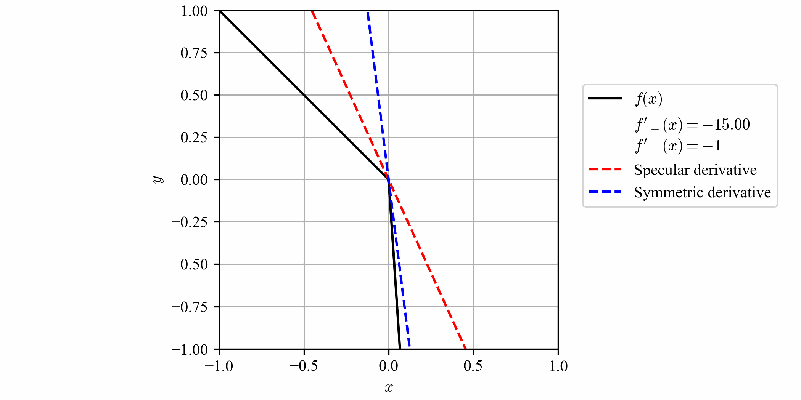

# Specular Differentiation


This repository contains the Python package `specular_diff` and codes for applications:

* [[**Nonsmooth convex optimization**]](#nonsmooth-convex-optimization)
  * Directory: `nonsmooth-convex-opt/`
  * Related reference: [[2]](#references), [[5]](#references)

* [[**Initial value problems for ordinary differential equations**]](#initial-value-problems-for-ordinary-differential-equations)
  * Directory: `numerical-ODE/`
  * Related reference: [[1]](#references), [[3]](#references), [[4]](#references)

## Installation

You can install the released version directly from PyPI:

```bash
pip install specular-differentiation
```

## Introduction

Specular differentiation generalizes classical differentiation.



## Applications

### Nonsmooth convex optimization

### Initial value problems for ordinary differential equations

## References

[1] K. Jung. Nonlinear numerical schemes using specular differentiation for initial value problems of first-order ordinary differential equations. arXiv preprint arXiv:??, 2025.

[2] K. Jung. Specular differentiation in normed vector spaces and its applications to nonsmooth convex optimization. arXiv preprint arXiv:??, 2025. 

[3] K. Jung and J. Oh. [The specular derivative](https://arxiv.org/abs/2210.06062). *arXiv preprint arXiv:2210.06062*, 2022.

[4] K. Jung and J. Oh. [The wave equation with specular derivatives](https://arxiv.org/abs/2210.06933). *arXiv preprint arXiv:2210.06933*, 2022.

[5] K. Jung and J. Oh. [Nonsmooth convex optimization using the specular gradient method with root-linear convergence](https://arxiv.org/abs/2412.20747). *arXiv preprint arXiv:2210.06933*, 2024.