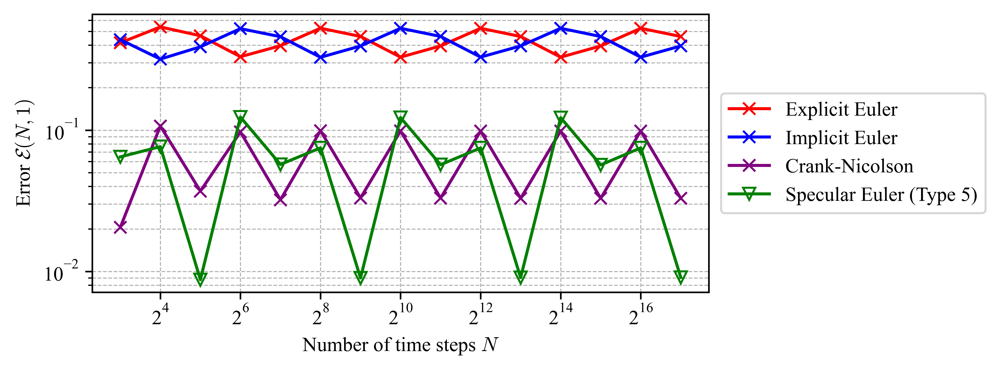

# Specular Differentiation


This repository contains the Python package `specular_diff` and codes for applications:

* [**Nonsmooth convex optimization**](#nonsmooth-convex-optimization)
  * Directory: `nonsmooth-convex-opt/`
  * Related reference: [[2]](#references), [[5]](#references)

* [**Initial value problems for ordinary differential equations**](#initial-value-problems-for-ordinary-differential-equations)
  * Directory: `numerical-ODE/`
  * Related reference: [[1]](#references), [[3]](#references), [[4]](#references)


## Installation

You can install the released version directly from PyPI:

```bash
pip install specular-differentiation
```

## Introduction

*Specular differentiation* generalizes classical differentiation.
A specular derivative can be understood as the average of the inclination angles of the right and left derivatives. 
In contrast, a symmetric derivative is the average of the right and left derivatives.
Their difference is illustrated as in the following figure.


## Applications

Specular differentiation is defined in normed vector spaces, allowing for applications in higher-dimensional Euclidean spaces. 
Two applications are provided in this repository.

### Nonsmooth convex optimization

In [[2]](#references), *the specular gradient method* is introduced for optimizing nonsmooth convex objective functions.

### Initial value problems for ordinary differential equations

In [[1]](#references), *the specular Euler scheme of Type 5* is introduced for solving ODEs numerically, yielding more accurate numerical solutions than classical schemes: the explicit and implicit Euler schemes and the Crank-Nicolson scheme.




## LaTeX notation

To use the specular differentiation symbol in your LaTeX document, please follow these steps.

### Setup 

Add the following code to your LaTeX preamble (before `begin{document}`):

```latex
% Required packages
\usepackage{graphicx}
\usepackage{bm}

% Definition of Specular Differentiation symbol
\newcommand\spd[1][.5]{\mathbin{\vcenter{\hbox{\scalebox{#1}{\,$\bm{\wedge}$}}}}}
```

### Usage examples 

You can use the symbol in your document (after `begin{document}`):

```latex
% A specular derivative in the one-dimensional Euclidean space
$f^{\spd}(x)$

% A specular directional derivative in normed vector spaces
$\partial^{\spd}_v f(x)$
```


## References

[1] K. Jung. *Nonlinear numerical schemes using specular differentiation for initial value problems of first-order ordinary differential equations*. arXiv preprint arXiv:??, 2025.

[2] K. Jung. *Specular differentiation in normed vector spaces and its applications to nonsmooth convex optimization*. arXiv preprint arXiv:??, 2025. 

[3] K. Jung and J. Oh. [*The specular derivative*](https://arxiv.org/abs/2210.06062). *arXiv preprint arXiv:2210.06062*, 2022.

[4] K. Jung and J. Oh. [*The wave equation with specular derivatives*](https://arxiv.org/abs/2210.06933). *arXiv preprint arXiv:2210.06933*, 2022.

[5] K. Jung and J. Oh. [*Nonsmooth convex optimization using the specular gradient method with root-linear convergence*](https://arxiv.org/abs/2412.20747). *arXiv preprint arXiv:2210.06933*, 2024.