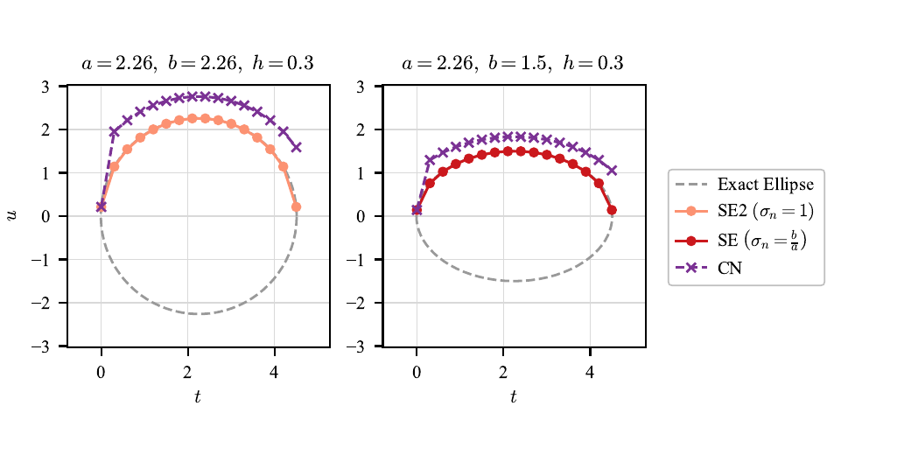
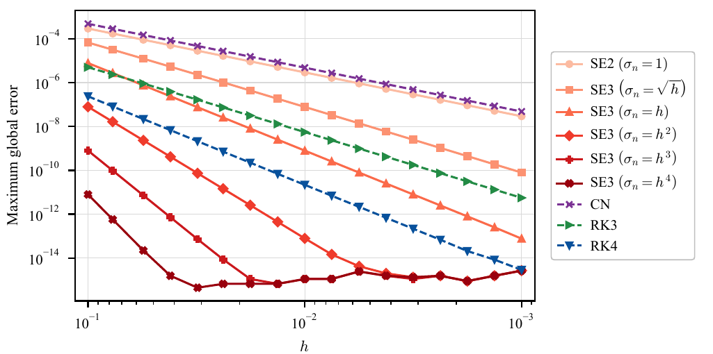
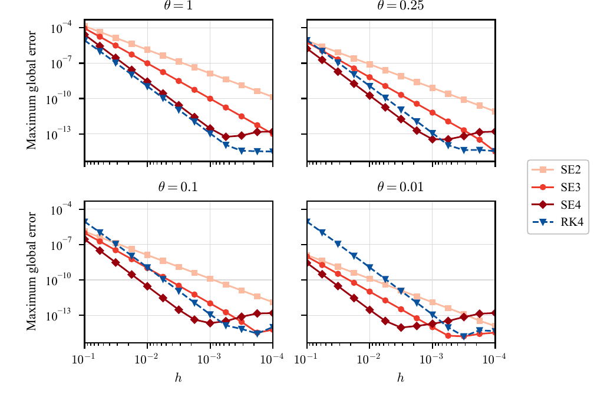
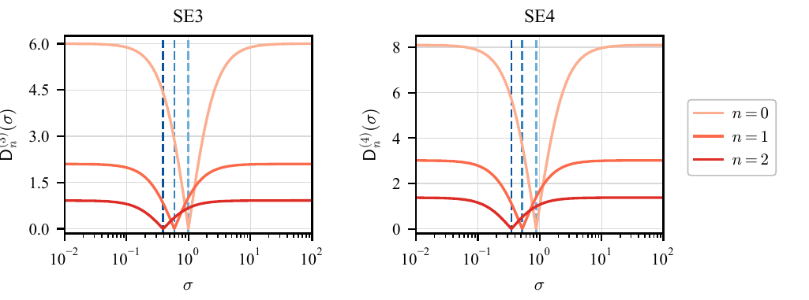
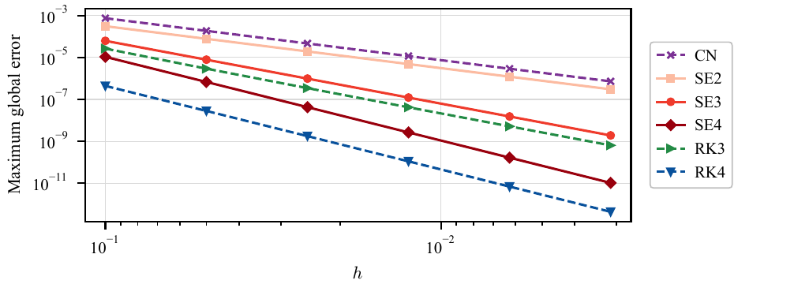
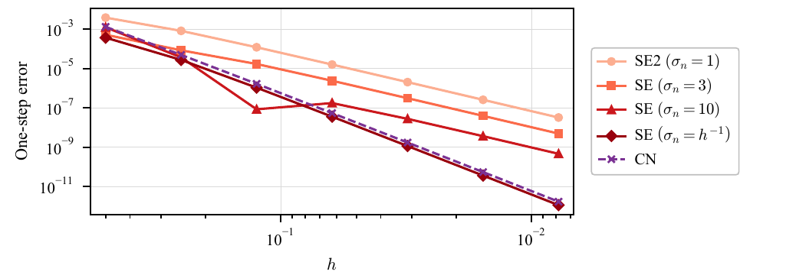

# Scalar ODE examples

These six scripts reproduce the scalar ODE experiments discussed in the manuscript.
They use the public `specular` API and save their canonical PDF figures under `examples/ode/figures/`.

!!! note "SE2, SE3, and SE4 on this page"

    These labels refer to second-, third-, and fourth-order configurations of the specular ellipse scheme.
    SE2 uses `sigma_n=1`, SE3 uses a pointwise defect condition or a problem-specific vanishing-scale family, and SE4 balances the defect at two consecutive endpoints.
    This SE2 is `ellipse_scheme(..., sigma_n=1)`, which equals `euler_scheme_5`; it is not `euler_scheme_2`.

Install the development dependencies, then run any script from the repository root:

```bash
pip install -e ".[dev]"
python examples/ode/ellipse_exactness.py
```

The order statements below are numerical observations for the stated problems.
The [ODE API warning](../../api/ode.md#automatic-scale-selection-modes) summarizes the hypotheses required by the convergence results.

## Exact tracing

For

\[
u'=-\frac{b^2(t-p)}{a^2u},
\qquad
u(t)=b\sqrt{1-\left(\frac{t-p}{a}\right)^2},
\]

the fitted scale is \(\sigma_n=b/a\).
The two panels use \(p=2.25\), \(h=0.3\), and \((a,b)=(2.26,2.26)\) or \((2.26,1.5)\).
The fitted SE trajectory reaches the exact ellipse at every mesh point, subject to the unique admissible implicit update assumed by the exactness result; CN does not.



[Python source](https://github.com/kyjung2357/specular-differentiation/blob/v1.3.0-dev/examples/ode/ellipse_exactness.py)
· [PDF figure](https://github.com/kyjung2357/specular-differentiation/blob/v1.3.0-dev/examples/ode/figures/ellipse_exactness.pdf)

## Vanishing scales

For \(u'=u^{-1}\), \(u(0)=1\), on \([0,1]\), the script compares \(\sigma_n=1\) and \(\sigma_n=h^p\) with \(p\in\{1/2,1,2,3,4\}\), together with CN, RK3, and RK4.
The higher orders visible for the vanishing scales follow a direct estimate for this particular equation; they are not general SE3 guarantees.
At the smallest errors, roundoff and nonlinear-solver tolerances become visible.



[Python source](https://github.com/kyjung2357/specular-differentiation/blob/v1.3.0-dev/examples/ode/inverse_equation_small_scale.py)
· [PDF figure](https://github.com/kyjung2357/specular-differentiation/blob/v1.3.0-dev/examples/ode/figures/inverse_equation_small_scale.pdf)

## Optimal scales for a normalized pendulum branch

The normalized positive-velocity phase equation is

\[
\frac{du}{d\xi}=-\frac{\sin(\theta\xi)}{\theta u},
\qquad 0\leq\xi\leq0.8.
\]

The four panels compare SE2, the pointwise SE3 selector, the two-endpoint SE4 selector, and RK4 for \(\theta=1,0.25,0.1,0.01\).
This is a normalized phase equation, not the original time-domain pendulum.
The curves compare accuracy at the same step size, not at the same runtime or number of field evaluations.



[Python source](https://github.com/kyjung2357/specular-differentiation/blob/v1.3.0-dev/examples/ode/pendulum_fourth_order.py)
· [PDF figure](https://github.com/kyjung2357/specular-differentiation/blob/v1.3.0-dev/examples/ode/figures/pendulum_fourth_order.pdf)

## Defect cancellation for quadratic decay

For \(u'=-u^2\), \(u(0)=1\), the two panels plot the absolute pointwise defect used by SE3 and the absolute two-endpoint defect used by SE4.
The exact states at \(n=0,1,2\), with \(h=0.3\), are used so that the marked scales show the intended cancellation directly rather than accumulated global error.



[Python source](https://github.com/kyjung2357/specular-differentiation/blob/v1.3.0-dev/examples/ode/quadratic_decay_defect_cancellation.py)
· [PDF figure](https://github.com/kyjung2357/specular-differentiation/blob/v1.3.0-dev/examples/ode/figures/quadratic_decay_defect_cancellation.pdf)

## Convergence for quadratic decay

For the same quadratic decay problem on \([0,1]\), the maximum global errors show the expected second-order behavior of CN and SE2, third-order behavior of SE3 and RK3, and fourth-order behavior of SE4 and RK4.
Unlike the pendulum illustration, this problem supplies a clean instance of the uniform branch assumptions used by the fourth-order convergence theorem.



[Python source](https://github.com/kyjung2357/specular-differentiation/blob/v1.3.0-dev/examples/ode/quadratic_decay_convergence.py)
· [PDF figure](https://github.com/kyjung2357/specular-differentiation/blob/v1.3.0-dev/examples/ode/figures/quadratic_decay_convergence.pdf)

## Diverging scales

For \(u'=1-u^2\), each \(h\) uses a separately selected exact endpoint pair from the large-scale boundary case.
The figure compares fixed scales \(\sigma_n=1,3,10\), the diverging scale \(\sigma_n=h^{-1}\), and CN.
It is a one-step experiment, not a global-convergence plot: the fixed scales exhibit third-order one-step error here, while \(h^{-1}\) and CN exhibit fifth-order one-step error.



[Python source](https://github.com/kyjung2357/specular-differentiation/blob/v1.3.0-dev/examples/ode/autonomous_large_scale.py)
· [PDF figure](https://github.com/kyjung2357/specular-differentiation/blob/v1.3.0-dev/examples/ode/figures/autonomous_large_scale.pdf)
