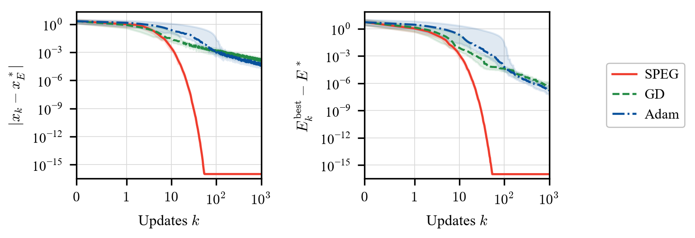
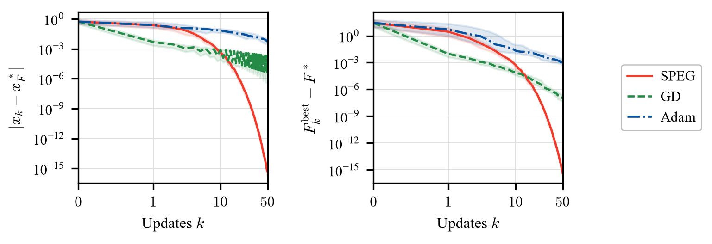

# One dimension

!!! info paper "Paper"

    --8<-- "README.md:ref-speg-one-dimension"

This page implements the paper's two scalar convex optimization experiments:
Elastic Net and a sum of absolute values. SPEG is compared with gradient descent
(GD) and Adam over 100 shared initial points for each objective.
The Elastic Net example uses \(\lambda_1=1\) and 1000 updates. The sum of
absolute values uses 50 updates, ending at \(k=50\).

## Run the examples

From the repository root, install the package and plotting dependencies, then
run the comparison:

```bash
pip install -e .
pip install matplotlib torch
python examples/optimization/one_dimension.py
```

The script saves PDF figures and PNG previews under
`examples/optimization/figures/`, with raw results under
`examples/optimization/results/`. It requires the optimization API in
`specular-differentiation` 1.3.1 or newer.

The [single Python file](https://github.com/kyjung2357/specular-differentiation/blob/main/examples/optimization/one_dimension.py)
contains the objectives, settings, methods, plots, and exports. Run it with the
package installed.

To run only SPEG, install `matplotlib` and use `--speg-only`; PyTorch is needed
only for GD, Adam, and learning-rate tuning:

```bash
pip install matplotlib
python examples/optimization/one_dimension.py --speg-only
python examples/optimization/one_dimension.py --example elastic-net
python examples/optimization/one_dimension.py --example absolute-sum
```

## Change the experiment

The settings at the top of `one_dimension.py` control the entire run:

```python
lambda_1 = 1.0
lambda_2 = 0.5
m = 100
num_runs = 100
max_iter = 1000
absolute_sum_max_iter = 50

example = "both"
tune_learning_rates = True
backend = "numpy"
```

`lambda_1`, `lambda_2`, and `m` configure Elastic Net. `num_runs` is the number
of independent initial points for each objective. `max_iter` sets the Elastic
Net update count; `absolute_sum_max_iter` sets the absolute-sum update count.
The defaults use 100 runs for each objective, saving \(x_0,\ldots,x_{1000}\)
for Elastic Net and \(x_0,\ldots,x_{50}\) for the absolute sum. Thus \(k=50\)
means 50 updates in each run, not 50 initial points.
The data and initial-point seeds can also be edited in the same settings
block. The sum-of-absolute-values objective has 100 pairs of terms independently
of the Elastic Net value of `m`.

Command-line options override these settings for a single execution.
In particular, `--updates N` applies the same budget to every selected
objective; omitting it preserves their separate settings:

```bash
python examples/optimization/one_dimension.py --example elastic-net --lambda1 100 --lambda2 1 --m 200
python examples/optimization/one_dimension.py --trials 20 --updates 500
python examples/optimization/one_dimension.py --backend numba
python examples/optimization/one_dimension.py --output-dir my-results
```

The backend can be `numpy`, `numba`, or `jax`, with the selected optional
dependency installed. It selects the calculation kernel for
`specular.scaled_mean`; the iteration and saved arrays use Python and NumPy.
The script enables JAX's 64-bit mode when selected. GD and Adam always use
PyTorch on the CPU in double precision. From the repository root, install an
optional backend with `pip install -e ".[numba]"` or `pip install -e ".[jax]"`.
See the [Backend API](../../api/backend.md) for package-wide backend usage.

## SPEG with geometric step lengths

The normalized SPEG update is

\[
x_{k+1}=x_k-t_k\frac{f^{\sd}(x_k)}{|f^{\sd}(x_k)|},
\qquad t_k=t_0\cdot\left(\frac{1}{2}\right)^k,
\]

with the iterate retained when the specular derivative is zero. The examples
provide analytic left and right derivatives and combine them with the package's
`specular.scaled_mean`. This avoids finite-difference error in the comparison.

From `examples/optimization/`, a single Elastic Net run can be written as:

```python
import specular
from one_dimension import random_problem

problem = random_problem(m=100, seed=20260907, lambda1=1.0, lambda2=0.5)
t0 = 3.0

result = specular.specular_gradient(
    problem.objective,
    initial_point=2.0,
    step_size="geometric_series",
    a=2 * t0,
    r=0.5,
    gradient=problem.analytic_gradient,
    max_iter=1000,
    tol=0.0,
)
print(result.solution, result.func_val, result.stop_reason)
```

The package numbers steps from \(n=1\) and uses \(a r^n\), so `a=2*t0`
and `r=0.5` give the first step length \(t_0\). Here `tol=0.0` is used for
the fixed-budget comparison. After an exact zero-gradient stop, or a step that
can no longer change the point at working precision, the runner retains the
final point for the remaining indices. Long runs also retain the last point
once the geometric step reaches the float64 range limit.
The actual update count and stop reason
are saved for each run.
See the [Optimization API](../../api/optimization.md) for the general stopping
and step-size options.

The paper's R-linear convergence theorem assumes a finite convex function on
\(\mathbb R\) that attains its minimum and
\(\operatorname{dist}(x_0,X^\ast)\leq2t_0\). Under these assumptions, in exact
arithmetic the iterates converge to a minimizer with
\(|x_k-x^\ast|\leq2t_0\cdot2^{-k}\). The initial distance condition is satisfied
by all default starts below. The theorem concerns one-dimensional problems;
the displayed experiments illustrate its stated setting.

When changed Elastic Net settings move the minimizer, the runner enlarges
\(t_0\) if necessary so that all starts in \([-4,4]\) satisfy the initial
distance condition. Metadata records the actual minimizer and \(t_0\).

## Elastic Net

For a scalar variable \(x\), consider

\[
E(x)=\frac{1}{2m}\lVert Ax-\mathbf b\rVert^2
+\frac{\lambda_2}{2}x^2+\lambda_1|x|.
\]

The experiment uses \(m=100\) independent standard normal observations in
\(A\), \(b_i=1\), \(\lambda_1=1\), and \(\lambda_2=\frac{1}{2}\).
One fixed data set is shared by all methods and initial points. Its unique
minimizer is \(x_E^\ast=0\), with \(E^\ast=\frac{1}{2}\).
The 100 initial points are uniform on \([-4,4]\), and SPEG uses \(t_0=3\).
Each run uses 1000 updates.



[Python source](https://github.com/kyjung2357/specular-differentiation/blob/main/examples/optimization/one_dimension.py)
· [PDF figure](https://github.com/kyjung2357/specular-differentiation/blob/main/examples/optimization/figures/elastic_net.pdf)

## Sum of absolute values

The second objective is

\[
F(x)=\sum_{i=0}^{99}\left(
\left|x-\frac{i}{100}\right|+\left|x+\frac{i}{100}\right|
\right).
\]

It is convex and piecewise linear, with 199 nondifferentiable points, and is
not strongly convex. Since \(F(x)\geq99+2|x|\) and \(F(0)=99\), its unique
minimizer is \(x_F^\ast=0\) and its minimum is \(F^\ast=99\).
The 100 initial points are uniform on \([-1,1]\), and SPEG uses
\(t_0=\frac{1}{2}\). Each run uses 50 updates, so the last iterate shown
is \(x_{50}\).



[Python source](https://github.com/kyjung2357/specular-differentiation/blob/main/examples/optimization/one_dimension.py)
· [PDF figure](https://github.com/kyjung2357/specular-differentiation/blob/main/examples/optimization/figures/absolute_sum.pdf)

## Comparison settings and errors

All runs use double precision. The update budget is 1000 for Elastic Net and
50 for the sum of absolute values, with 100 initial points per objective.
The default data seed is `20260907`, and the shared initial-point seed is `20260905`.
GD uses no momentum; Adam uses its standard parameters
\(\beta_1=0.9\), \(\beta_2=0.999\), and \(\varepsilon=10^{-8}\).
Both use PyTorch automatic differentiation of the full objective, with
\(\operatorname{sgn}(0)=0\) for absolute-value terms.

The displayed run uses the following SPEG steps and selected baseline schedules:

| Objective | Updates | SPEG step length \(t_k\) | GD learning rate \(\alpha_k\) | Adam learning rate \(\alpha_k\) |
| --- | ---: | --- | --- | --- |
| Elastic Net | 1000 | \(3\cdot2^{-k}\) | \(\frac{3}{10(k+1)}\) | \(\frac{2}{3(k+1)}\) |
| Sum of absolute values | 50 | \(\frac{1}{2}\cdot2^{-k}\) | \(\frac{1}{200(k+1)}\) | \(\frac{3}{10(k+1)}\) |

The default runner repeats the paper's learning-rate search for the current
objective and update count. Each GD and Adam candidate is evaluated on 100
independent starts, using default seed `20260906` and schedules
\(\alpha_0\cdot(k+1)^{-p}\) with \(p\in\{0,\frac{1}{2},1\}\).
Among candidates with no nonfinite runs, selection minimizes the mean final
objective gap, with deterministic tie-breaking for equal or very small gaps.
The selected schedule is then fixed for all test starts. This finite search
does not guarantee the best possible learning rate.

The tuning starts are separate from the test starts. If the test seed is
`20260906`, the tuning seed becomes `20260908`; metadata records the seed used.
Changing the regularization, data, or update count automatically runs the
search again. `--speg-only` skips the comparisons and tuning entirely.

To reuse the selected schedules shown above for the default configuration,
use `--no-tune`. These fixed reference rates are stored in `REFERENCE_RATES`
in the script. Leave tuning enabled when changing the objective or update
count so that the rates are selected for the new settings:

```bash
python examples/optimization/one_dimension.py --no-tune
```

Each figure shows median errors and interquartile bands over the 100 runs.
The left panel measures the **current iterate**, \(|x_k-x_E^\ast|\) for Elastic
Net and \(|x_k-x_F^\ast|\) for the absolute sum. The right panel measures the
**best objective observed so far**, \(E_k^{\mathrm{best}}-E^\ast\) or
\(F_k^{\mathrm{best}}-F^\ast\), where
\(E_k^{\mathrm{best}}=\min_{0\leq j\leq k}E(x_j)\) and similarly for \(F\).
These differ because SPEG and the baseline methods can increase the objective
at an individual update. Figures and generated tables use the same objective
and minimizer notation.

The objective gaps use algebraically equivalent expressions that avoid
subtracting nearly equal function values. Values below \(10^{-16}\) are
displayed at \(10^{-16}\) only in the figures; the saved results retain raw
errors. The horizontal axis is linear near zero and logarithmic from update 1.

The current default experiment, with Elastic Net \(\lambda_1=1\) and baselines
retuned for each objective's update budget, gives these terminal median errors:

**Elastic Net:** median errors at \(k=1000\) over 100 initial points.

| Method | Median \(\lvert x_k-x_E^\ast\rvert\) | Median \(E_k^{\mathrm{best}}-E^\ast\) |
| --- | ---: | ---: |
| SPEG | \(1.87\times10^{-301}\) | \(1.50\times10^{-301}\) |
| GD | \(1.29\times10^{-4}\) | \(5.48\times10^{-7}\) |
| Adam | \(4.44\times10^{-5}\) | \(1.76\times10^{-7}\) |

**Sum of absolute values:** median errors at \(k=50\) over 100 initial points.

| Method | Median \(\lvert x_k-x_F^\ast\rvert\) | Median \(F_k^{\mathrm{best}}-F^\ast\) |
| --- | ---: | ---: |
| SPEG | \(4.44\times10^{-16}\) | \(4.44\times10^{-16}\) |
| GD | \(1.96\times10^{-4}\) | \(1.00\times10^{-7}\) |
| Adam | \(5.49\times10^{-3}\) | \(1.01\times10^{-3}\) |

The very small SPEG errors for Elastic Net arise in this example with an exact
zero minimizer; they do not imply comparable accuracy for a general objective.
For the sum of absolute values, 25 of the 100 SPEG runs have already reached
zero at \(k=50\), while the median errors remain positive. GD reaches a small
best objective gap while its current iterate continues to oscillate.

Running the script saves the full trajectories and initial points in
`results/trajectories.npz`; the default trajectory arrays have shape
`(100, 1001)` for Elastic Net and `(100, 51)` for the absolute sum. It also saves
the Elastic Net data in `results/elastic_data.npz`,
the unrounded summary in `results/summary.csv`, separate LaTeX tables in
`results/elastic_net_summary.tex` and `results/absolute_sum_summary.tex`, and the settings in
`results/metadata.json` and `results/selected_parameters.csv`.
With tuning enabled, `results/tuning.csv` also records all learning-rate candidates.
Use `--output-dir PATH` to place these files and figures in another directory.
Use a separate output directory for each configuration you want to preserve;
a successful rerun replaces its results and removes generated outputs for
objectives or comparison stages omitted from that run.

Each LaTeX table rounds errors to three significant digits and contains the
method and the two median errors for one objective. The objective and update
count belong in its caption. Only tables for the objectives run are generated,
and each contains only the methods run, including SPEG-only runs. Load
`booktabs` in your preamble, then include the tables with paths relative to
your main `.tex` file. The captions below use the default update budgets:

```latex
% Preamble
\usepackage{booktabs}

% Document body
\begin{table}[tbp]
  \centering
  \caption{Median errors for the Elastic Net at $k=1000$ over $100$ initial points.}
  \input{examples/optimization/results/elastic_net_summary.tex}
\end{table}
\begin{table}[tbp]
  \centering
  \caption{Median errors for the sum of absolute values at $k=50$ over $100$ initial points.}
  \input{examples/optimization/results/absolute_sum_summary.tex}
\end{table}
```
