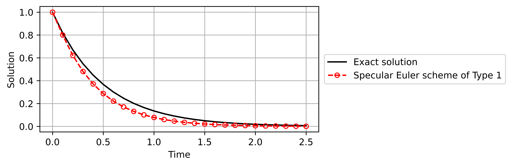
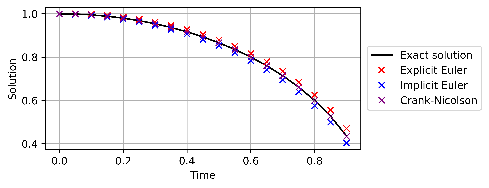

# Specular Differentiation tutorial

Denote by $ℕ$ the set of all positive integers. 
For each $n \in ℕ$, denote by $ℝ$ the $n$-dimensional Euclidean space.

## 1. Calculation of specular differentiation

In `core.py`, there are four modules to calculate specular differentiation, depending on the dimension. 

### 1.1 the one-dimensional Euclidean space ($n=1$)

In $ℝ$, the *specular derivative* can be calculated using the function `derivative`.

```python
>>> import specular
>>> 
>>> def f(x):
>>>     return max(x, 0.0)
>>> 
>>> specular.derivative(f, x=0.0)
0.41421356237309515
```

### 1.2 the $n$-dimensional Euclidean space ($n>1$)

In $ℝ^n$, the *specular directional derivative* of a function $f: ℝ^n \to ℝ$ at a point $x \in ℝ^n$ in the direction $v \in ℝ^n$ can be calculated using the function `directional_derivative`.

```python
>>> import specular
>>> import math 
>>>
>>> f = lambda x: math.sqrt(x[0]**2 + x[1]**2 + x[2]**2)
>>> specular.directional_derivative(f, x=[0.0, 0.1, -0.1], v=[1.0, -1.0, 2.0])
-2.1213203434708223
```

Let $e_1, e_2, \ldots, e_n$ be the standard basis of $ℝ^n$.
For each $i \in ℕ$ with $1 \leq i \leq n$, the *specular partial derivative* with respect to a variable $x_i$ can be calculated using the function `partial_derivative`, which yields the same result as `directional_derivative` with direction $v=e_i$.

```python
>>> import specular
>>> import math
>>>
>>> def f(x):
>>>     return math.sqrt(x[0]**2 + x[1]**2 + x[2]**2)
>>>
>>> specular.partial_derivative(f, x=[0.1, 2.3, -1.2], i=2)
0.8859268982863702
>>> specular.directional_derivative(f, x=[0.1, 2.3, -1.2], v=[0.0, 1.0, 0.0])
0.8859268982863702
```

Also, the *specular gradient* can be calculated using `gradient`.

```python
>>> import specular
>>> import numpy as np
>>>
>>> def f(x):
>>>     return np.linalg.norm(x)
>>> 
>>> specular.gradient(f, x=[0.1, 2.3, -1.2])
[ 0.03851856  0.8859269  -0.46222273]
>>> specular.partial_derivative(f, x=[0.1, 2.3, -1.2], i=1)
0.03851856078540371
>>> specular.partial_derivative(f, x=[0.1, 2.3, -1.2], i=2)
0.8859268982863702
>>> specular.partial_derivative(f, x=[0.1, 2.3, -1.2], i=3)
-0.4622227292028128
```

## 2. Numerical ordinary differential equations

Let the source function $F:[t_0, T] \times ℝ \to ℝ$ be given, and the initial data $u_0:ℝ \to ℝ$ be given. 
Consider the initial value problem:

$$
u'(t) = F(t, u(t))
$$ 

with the initial condition $u(t_0) = u_0(t_0)$.
To solve the problem numerically, the module `ode.py` provides the following methods:

* the specular Euler scheme (Type 1 ~ 6)
* the specular trigonometric scheme
* the explicit Euler scheme
* the implicit Euler scheme
* the Crank-Nicolson scheme

### 2.1 Specular Euler scheme

All functions return an instance of the `ODEResult` class that encapsulates the numerical results.

```python
>>> import specular
>>>
>>> def F(t, u):
>>>     return -2*u 
>>>
>>> specular.Euler_scheme(of_Type='1', F=F, t_0=0.0, u_0=1.0, T=2.5, h=0.1)
Running the specular Euler scheme of Type 1: 100%|██████████| 24/24 [00:00<?, ?it/s]
<specular.ode.result.ODEResult at 0x1765982d8d0>
```

To access the numerical results, call `.values()`.
It returns a tuple containing the time grid and the numerical solution.

```python
>>> import specular
>>>
>>> def F(t, u):
>>>     return -2*u 
>>>
>>> specular.Euler_scheme(of_Type=1, F=F, t_0=0.0, u_0=1.0, T=2.5, h=0.1).values()
Running the specular Euler scheme of Type 1: 100%|██████████| 24/24 [00:00<?, ?it/s]
(array([0. , 0.1, 0.2, 0.3, 0.4, 0.5, 0.6, 0.7, 0.8, 0.9, 1. , 1.1, 1.2,
        1.3, 1.4, 1.5, 1.6, 1.7, 1.8, 1.9, 2. , 2.1, 2.2, 2.3, 2.4, 2.5]),
 array([1.        , 0.8       , 0.62169432, 0.48101574, 0.37172557,
        0.2870388 , 0.22149069, 0.17081087, 0.13166787, 0.1014624 ,
        0.07816953, 0.06021577, 0.04638162, 0.0357239 , 0.02751427,
        0.02119088, 0.01632056, 0.0125695 , 0.00968054, 0.00745555,
        0.00574195, 0.00442221, 0.00340579, 0.00262299, 0.00202011,
        0.0015558 ]))
```

To visualize the numerical results, call `.visualization()`.

```python
>>> import specular
>>> import numpy as np
>>>
>>> def F(t, u):
>>>    return -2*u 
>>> 
>>> def exact_sol(t):
>>>     return np.exp(-2*t)
>>> 
>>> def u_0(t_0):
>>>     return exact_sol(t_0)
>>> 
>>> specular.Euler_scheme(of_Type='1', F=F, t_0=0.0, u_0=u_0, T=2.5, h=0.1).visualization(exact_sol=exact_sol, save_path="specular-Euler-scheme-of-Type-1")
Running the specular Euler scheme of Type 1: 100%|██████████| 24/24 [00:00<?, ?it/s]
Figure saved: figures\specular-Euler-scheme-of-Type-1
```



To obtain the table of the numerical results, call `.table()`. 

```python
>>> import specular
>>> import numpy as np
>>>
>>> def F(t, u):
>>>     return -2*u
>>> 
>>> def exact_sol(t):
>>> return np.exp(-2*t)
>>>     
>>> def u_0(t_0):
>>>     return exact_sol(t_0)
>>> 
>>> specular.Euler_scheme(of_Type=4, F=F, t_0=0.0, u_0=u_0, T=2.5, h=0.1).table(exact_sol=exact_sol, save_path="specular-Euler-scheme-of-type-4")
Running the specular Euler scheme of Type 4: 100%|██████████| 25/25 [00:00<?, ?it/s]
Table saved: tables\specular-Euler-scheme-of-type-4.csv
```

`.visualization()` and `.table()` are are chainable.

```python
>>> import specular
>>> import numpy as np
>>>
>>> def F(t, u):
>>>     return -2*u
>>> 
>>> def exact_sol(t):
>>> return np.exp(-2*t)
>>>     
>>> def u_0(t_0):
>>>     return exact_sol(t_0)
>>> 
>>> specular.Euler_scheme(of_Type=4, F=F, t_0=0.0, u_0=u_0, T=2.5, h=0.1).visualization(exact_sol=exact_sol).table(exact_sol=exact_sol)
Running the specular Euler scheme of Type 4: 100%|██████████| 25/25 [00:00<?, ?it/s]
```

To compute the total error of the numerical results, call `.total_error()`.
The exact solution is required.
The norm can be `max`, `l1`, or `l2`.

```python
>>> def F(t, u):
>>>     return -2*u 
>>> 
>>> def exact_sol(t):
>>>     return np.exp(-2*t)
>>> 
>>> def u_0(t_0):
>>>     return exact_sol(t_0)
>>> 
>>> specular.Euler_scheme(of_Type=5, F=F, t_0=0.0, u_0=u_0, T=10.0, h=0.1).total_error(exact_sol=exact_sol, norm='max')
Running the specular Euler scheme of Type 5: 100%|██████████| 100/100 [00:00<00:00, 300882.64it/s]
0.0011409613137273178
```

### 2.2 Specular trigonometric scheme

```python
>>> import specular
>>>
>>> def F(t, u):
>>>     return -2*u 
>>> 
>>> def exact_sol(t):
>>>     return np.exp(-2*t)
>>> 
>>> def u_0(t_0):
>>>     return exact_sol(t_0)
>>> 
>>> u_1 = exact_sol(t_0 + h)
>>> 
>>> specular.trigonometric_scheme(F=F, t_0=0.0, u_0=u_0, u_1=u_1, T=2.5, h=0.1).visualization(exact_sol=exact_sol, save_path="specular-trigonometric")
Running specular trigonometric scheme: 100%|██████████| 24/24 [00:00<?, ?it/s]
Figure saved: figures\specular-trigonometric
```


### 2.3 Classical schemes

The three classical schemes are available: the explicit Euler, the implicit Euler, and the Crank-Nicolson schemes.

```python
>>> import specular
>>> import numpy as np
>>> import matplotlib.pyplot as plt
>>> 
>>> def F(t, u):
>>>     return -(t*u)/(1-t**2)
>>>
>>> def exact_sol(t):
>>>     return np.sqrt(1 - t**2)
>>>
>>> def u_0(t_0):
>>>     return exact_sol(t_0)
>>>
>>> t_0 = 0.0
>>> T = 0.9
>>> h = 0.05
>>> 
>>> result_EE = specular.ode.solver.classical_scheme(F=F, t_0=t_0, u_0=u_0, T=T, h=h, scheme="explicit Euler").values()
>>> result_IE = specular.ode.solver.classical_scheme(F=F, t_0=t_0, u_0=u_0, T=T, h=h, scheme="implicit Euler").values()
>>> result_CN = specular.ode.solver.classical_scheme(F=F, t_0=t_0, u_0=u_0, T=T, h=h, scheme="Crank-Nicolson").values()
>>> exact_values = np.array([exact_sol(t) for t in result_EE[0]])
>>> 
>>> plt.figure(figsize=(5.5, 2.5))
>>> 
>>> plt.plot(result_EE[0], exact_values, color='black', label='Exact solution')
>>> plt.plot(result_EE[0], result_EE[1],  marker='x', linestyle='None', markerfacecolor='none', markeredgecolor='red', label='Explicit Euler') 
>>> plt.plot(result_IE[0], result_IE[1],  marker='x', linestyle='None', markerfacecolor='none', markeredgecolor='blue', label='Implicit Euler') 
>>> plt.plot(result_CN[0], result_CN[1],  marker='x', linestyle='None', markerfacecolor='none', markeredgecolor='purple', label='Crank-Nicolson')
>>> 
>>> plt.xlabel(r"Time", fontsize=10)
>>> plt.ylabel(r"Solution", fontsize=10)
>>> plt.grid(True)
>>> plt.legend(loc='center left', bbox_to_anchor=(1.02, 0.5), borderaxespad=0., fontsize=10)
>>> plt.savefig('figures/classical-schemes.png', dpi=1000, bbox_inches='tight')
>>> plt.show()
Running the explicit Euler scheme: 100%|██████████| 18/18 [00:00<?, ?it/s]
Running the implicit Euler scheme: 100%|██████████| 18/18 [00:00<?, ?it/s]
Running Crank-Nicolson scheme: 100%|██████████| 18/18 [00:00<00:00, 17988.44it/s]
```



## 3. Nonsmooth convex optimization


### 3.1. 

TBA

### 3.2.

TBA

### 3.3.

TBA 

### 3.4.