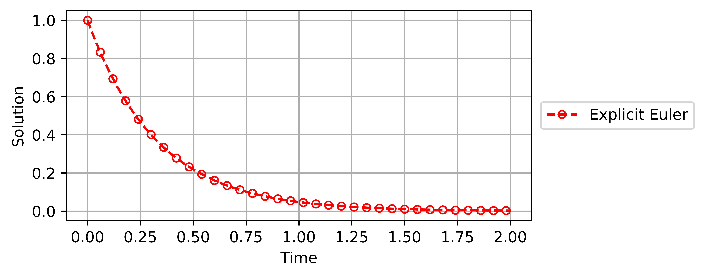
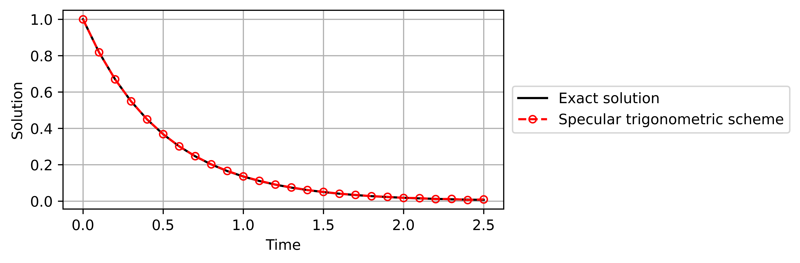

# Specular Differentiation tutorial

Denote by $ℕ$ the set of all positive integers. 
For each $n \in ℕ$, denote by $ℝ$ the $n$-dimensional Euclidean space.

## 1. Calculation of specular differentiation

In `core.py`, there are four modules to calculate specular differentiation, depending on the dimension. 

### 1.1 the one-dimensional Euclidean space

In $ℝ$, the *specular derivative* can be calculated using the function `derivative`.

```python
>>> import specular
>>> 
>>> def f(x):
>>>     return max(x, 0.0)
>>> 
>>> specular.derivative(f, x=0.0)
0.41421356237309515
```

### 1.2 the $n$-dimensional Euclidean space ($n>1$)

In $ℝ^n$, the *specular directional derivative* of a function $f: ℝ^n \to ℝ$ at a point $x \in ℝ^n$ in the direction $v \in ℝ^n$ can be calculated using the function `directional_derivative`.

```python
>>> import specular
>>> import math 
>>>
>>> f = lambda x: math.sqrt(x[0]**2 + x[1]**2 + x[2]**2)
>>> specular.directional_derivative(f, x=[0.0, 0.1, -0.1], v=[1.0, -1.0, 2.0])
-2.1213203434708223
```

Let $e_1, e_2, \ldots, e_n$ be the standard basis of $ℝ^n$.
For each $i \in ℕ$ with $1 \leq i \leq n$, the *specular partial derivative* with respect to a variable $x_i$ can be calculated using the function `partial_derivative`, which yields the same result as `directional_derivative` with direction $v=e_i$.

```python
>>> import specular
>>> import math
>>>
>>> def f(x):
>>>     return math.sqrt(x[0]**2 + x[1]**2 + x[2]**2)
>>>
>>> specular.partial_derivative(f, x=[0.1, 2.3, -1.2], i=2)
0.8859268982863702
>>> specular.directional_derivative(f, x=[0.1, 2.3, -1.2], v=[0.0, 1.0, 0.0])
0.8859268982863702
```

Also, the *specular gradient* can be calculated using `gradient`.

```python
>>> import specular
>>> import numpy as np
>>>
>>> def f(x):
>>>     return np.linalg.norm(x)
>>> 
>>> specular.gradient(f, x=[0.1, 2.3, -1.2])
[ 0.03851856  0.8859269  -0.46222273]
>>> specular.partial_derivative(f, x=[0.1, 2.3, -1.2], i=1)
0.03851856078540371
>>> specular.partial_derivative(f, x=[0.1, 2.3, -1.2], i=2)
0.8859268982863702
>>> specular.partial_derivative(f, x=[0.1, 2.3, -1.2], i=3)
-0.4622227292028128
```

## 2. Numerical ordinary differential equations

Let the source function $F:[t_0, T] \times ℝ \to ℝ$ be given, and the initial data $u_0:ℝ \to ℝ$ be given. 
Consider the initial value problem:

$$
u'(t) = F(t, u(t))
$$ 

with the initial condition $u(t_0) = u_0(t_0)$.
To solve the problem numerically, the module `ode.py` provides implementations of the specular Euler schemes, the Crank-Nicolson scheme, and the specular trigonometric scheme.

### 2.1 Classical schemes

The three classical schemes are available: the explicit Euler, the implicit Euler, and the Crank-Nicolson schemes.
By default, the function returns an instance of the `ODEResult` class that encapsulates the numerical results.

```python
>>> def F(t, u):
>>>    return -3*u 
>>>
>>> specular.ode.classical_scheme(F=F, u_0=1.0, t_0=0.0, T=2.0, h=0.1, scheme="explicit Euler")
Running the explicit Euler scheme: 100%|██████████| 20/20 [00:00<?, ?it/s]
<specular.tools.ODEResult at 0x277501e74d0>
``` 

To access the numerical results, call `.values()`.
It returns a tuple containing the time grid and the numerical solution.

```python
>>> def F(t, u):
>>>    return -3*u 
>>>
>>> specular.ode.classical_scheme(F=F, u_0=1.0, t_0=0.0, T=2.0, h=0.1, scheme="explicit Euler").values()
Running the explicit Euler scheme: 100%|██████████| 20/20 [00:00<?, ?it/s]
(array([0. , 0.1, 0.2, 0.3, 0.4, 0.5, 0.6, 0.7, 0.8, 0.9, 1. , 1.1, 1.2,
            1.3, 1.4, 1.5, 1.6, 1.7, 1.8, 1.9, 2. ]),
 array([1.00000000e+00, 7.00000000e-01, 4.90000000e-01, 3.43000000e-01,
        2.40100000e-01, 1.68070000e-01, 1.17649000e-01, 8.23543000e-02,
        5.76480100e-02, 4.03536070e-02, 2.82475249e-02, 1.97732674e-02,
        1.38412872e-02, 9.68890104e-03, 6.78223073e-03, 4.74756151e-03,
        3.32329306e-03, 2.32630514e-03, 1.62841360e-03, 1.13988952e-03,
        7.97922663e-04]))
``` 

To visualize the numerical results, call `.visualization()`.

```python
>>> def F(t, u):
>>>    return -3*u 
>>>
>>> specular.ode.classical_scheme(F=F, u_0=1.0, t_0=0.0, T=2.0, h=0.01, scheme="explicit Euler").visualization(save_path="explicit-Euler")
Running the explicit Euler scheme: 100%|██████████| 200/200 [00:00<?, ?it/s]
Figure saved: figures\explicit-Euler
``` 



To obtain the table of the numerical results, call `.table()`. 

```python
>>> def F(t, u):
>>>     return -(t*u)/(1-t**2)
>>> 
>>> def exact_sol(t):
>>>     return np.sqrt(1 - t**2)
>>>     
>>> def u_0(t_0):
>>>     return exact_sol(t_0)
>>> 
>>> specular.ode.solver.classical_scheme(F, t_0=0.0, u_0=u_0, T=0.9, h=0.01, scheme="implicit Euler").table(exact_sol=exact_sol)
Running the implicit Euler scheme: 100%|██████████| 90/90 [00:00<?, ?it/s]
Table saved: tables\implicit-Euler.csv
```

`.visualization()` and `.table()` are are chainable.

```python
>>> specular.ode.solver.classical_scheme(F, t_0=t_0, u_0=u_0, T=T, h=h, scheme="Crank-Nicolson").visualization(exact_sol=exact_sol).table(exact_sol=exact_sol)
```

### 2.2 Specular Euler scheme

TBA 

### 2.3 Specular trigonometric scheme

```python
>>> def F(t, u):
>>>     return -2*u 
>>> 
>>> def exact_sol(t):
>>>     return np.exp(-2*t)
>>> 
>>> def u_0(t_0):
>>>     return exact_sol(t_0)
>>> 
>>> u_1 = exact_sol(t_0 + h)
>>> 
>>> specular.trigonometric_scheme(F, t_0=0.0, u_0=u_0, u_1=u_1, T=2.5, h=0.1).visualization(exact_sol=exact_sol)
Running specular trigonometric scheme: 100%|██████████| 24/24 [00:00<?, ?it/s]
Figure saved: figures\specular-trigonometric
```


